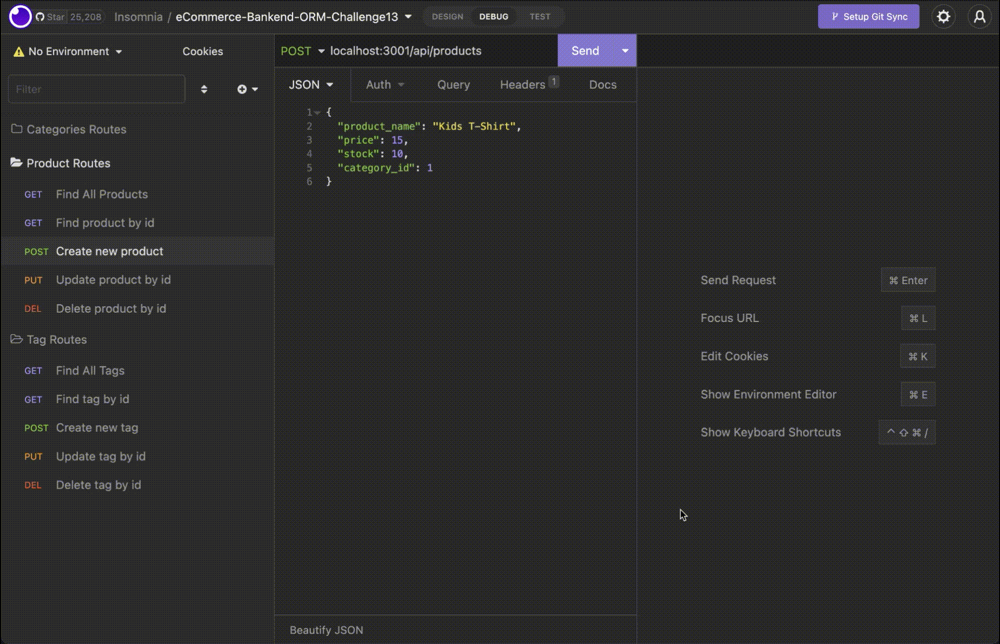
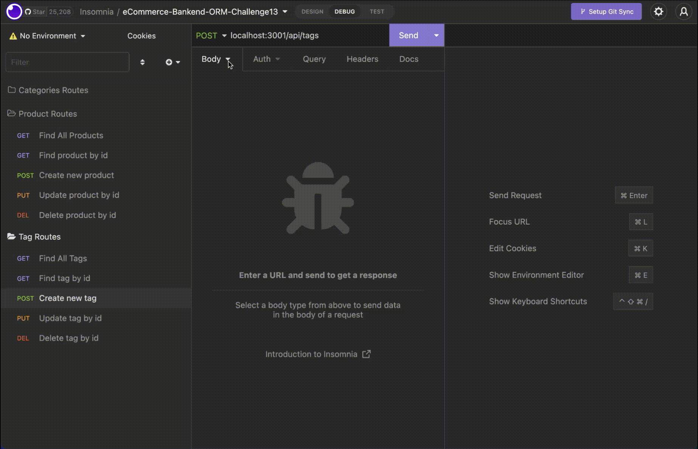

# e-commerce Backend

## Table of Contents
- [Description](description)
- [Database schema and routes](database-schema-routes)
- [Installation](installation)
- [Usage instructions](usage-instructions)
- [Demo and walkthough](demo-walkthough)


## Description


## Database schema and routes
The `Category` database consists of the following columns and constraints. 
```
+---------------+--------------+------+-----+---------+----------------+
| Field         | Type         | Null | Key | Default | Extra          |
+---------------+--------------+------+-----+---------+----------------+
| id            | int          | NO   | PRI | NULL    | auto_increment |
| category_name | varchar(255) | NO   |     | NULL    |                |
+---------------+--------------+------+-----+---------+----------------+

Routes
- GET API/CATEGORIES
- GET API/CATEGORIES/ID:
- POST API/CATEGORIES
- PUT API/CATEGORIES/ID:
- DEL API/CATEGORIES/ID:
```
The `` 


## Installation

1. Run `source schema.sql` at the `mySQL` prompt and setup the database.
2. If required, run `node seeds/index.js` at the command prompt to add test data to the database


## Usage instructions
- Enter `node server.js` at the command prompt to start the server. Pressing CTRL + C will stop the server.
- Use Insomnia (this is a free tool) to test the routes and CRUD opteration. See section **Demo and walthrough** for some examples on how to do this.

## Demo and walkthough
Here is a quick demo of how the application functions.
### Database setup, seeding and starting the server

### GET METHOD for ALL routes
```
The following routes are demonstrated in the short video below:
- API/CATEGORIES
- API/CATEGORIES/ID:
- API/PRODUCTS
- API/PRODUCTS/ID:
- API/TAGS
- API/TAGS/ID:
```


### POST, PUT and DEL routes for Products
```
The following routes are demonstrated in the short video below:
- POST API/PRODUCTS
- PUT API/PRODUCTS/ID:
- DEL API/PRODUCTS/ID:
```


### POST, PUT and DEL routes for Categories
```
The following routes are demonstrated in the short video below:
- POST API/CATEGORIES
- PUT API/CATEGORIES/ID:
- DEL API/CATEGORIES/ID:
```


### POST, PUT and DEL routes for Tags
```
The following routes are demonstrated in the short video below:
- POST API/TAGS
- PUT API/TAGS/ID:
- DEL API/TAGS/ID:
```

